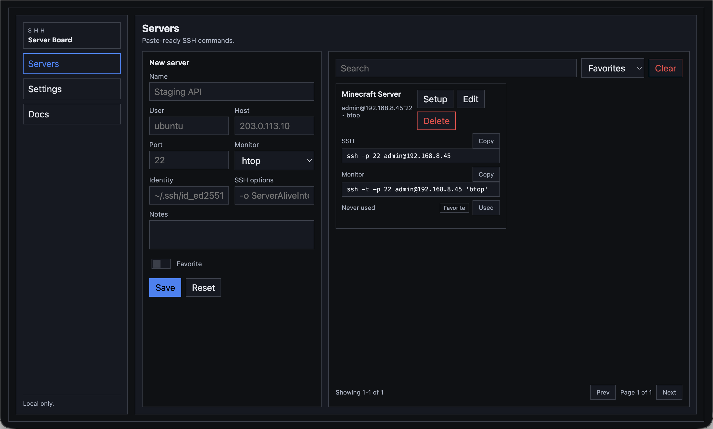
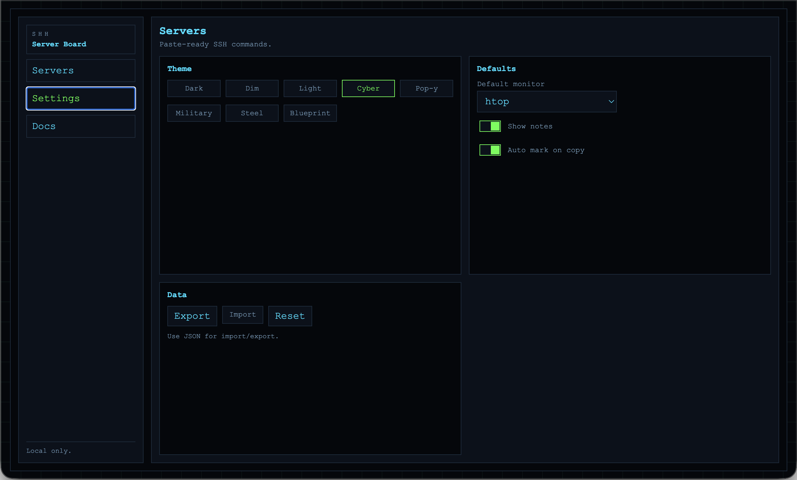
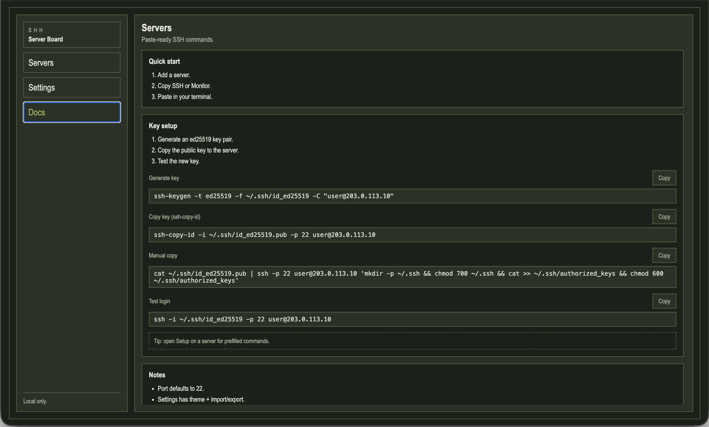

# SHH — Server Board

A local-first SSH command dashboard. Save your servers once, then copy paste-ready SSH and monitoring commands whenever you need them. No typing `ssh -i ~/.ssh/… -p … user@host` from memory ever again.

Everything runs in the browser and stays in `localStorage` — no server, no account, no telemetry.



---

## Features

- **One-click commands** — copy SSH login or htop/btop monitor commands instantly.
- **Key setup wizard** — per-server setup modal with prefilled `ssh-keygen`, `ssh-copy-id`, and manual copy commands.
- **Search, sort & paginate** — find servers by name, sort by favorites/name/recent/newest.
- **Import / Export** — back up and restore your server list as JSON.
- **8 themes** — Dark, Dim, Light, Cyber, Pop-y, Military, Steel, and Blueprint.
- **Fully local** — zero network requests; all data lives in your browser.

---

## Screenshots

| Cyber theme | Blueprint theme |
|:-----------:|:---------------:|
|  |  |



---

## Quick Start

1. Open `project/index.html` in your browser.
2. Add a server (name, user, host, port).
3. Click **SSH** or **Monitor** to copy the command.
4. Paste into your terminal.

---

## Project Structure

```
ssh-keeper/
├── project/
│   └── index.html   # entire app (single-file, no build step)
├── 1.png            # screenshot — dashboard
├── 2.png            # screenshot — cyber theme
├── 3.png            # screenshot — blueprint theme
├── 4.png            # screenshot — in-app docs
└── README.md
```

---

## License

This project is open source. Feel free to use, modify, and share.